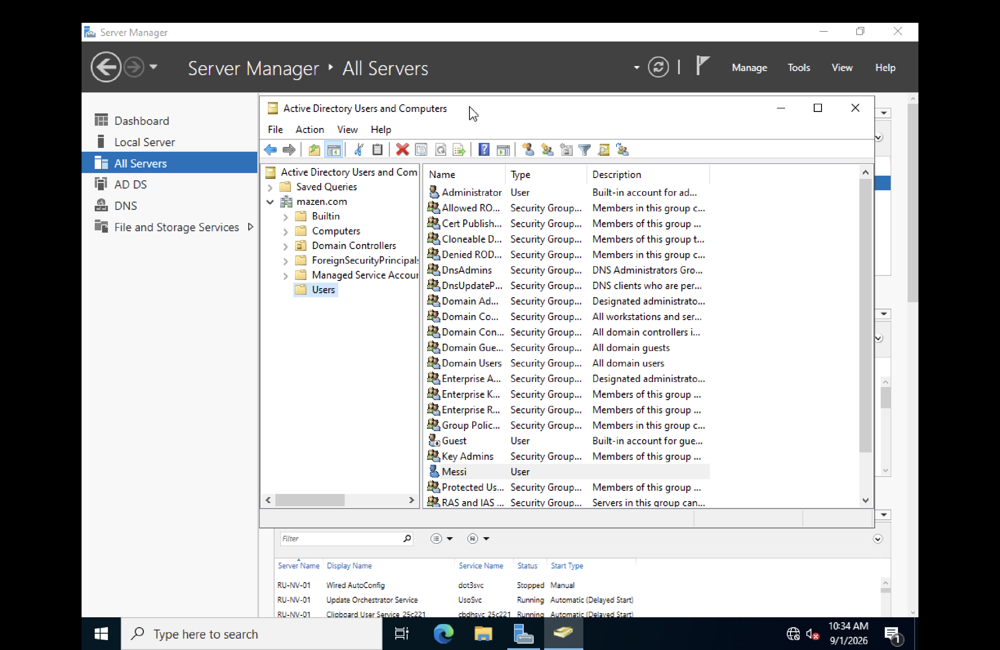
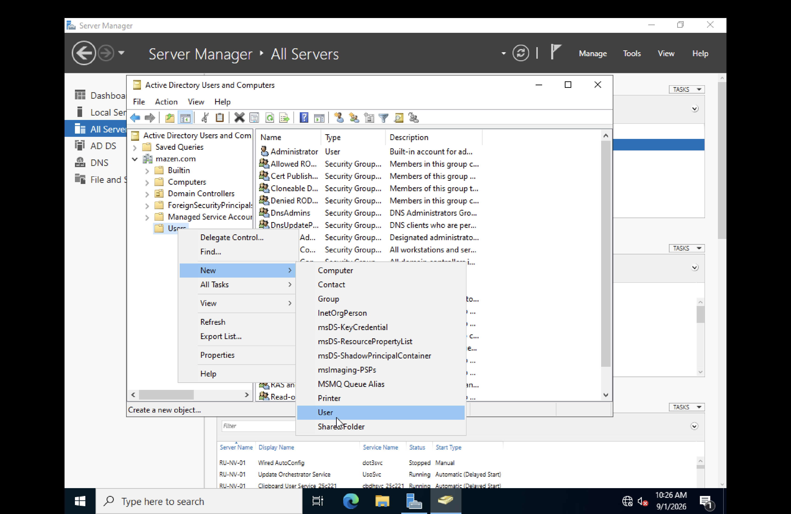
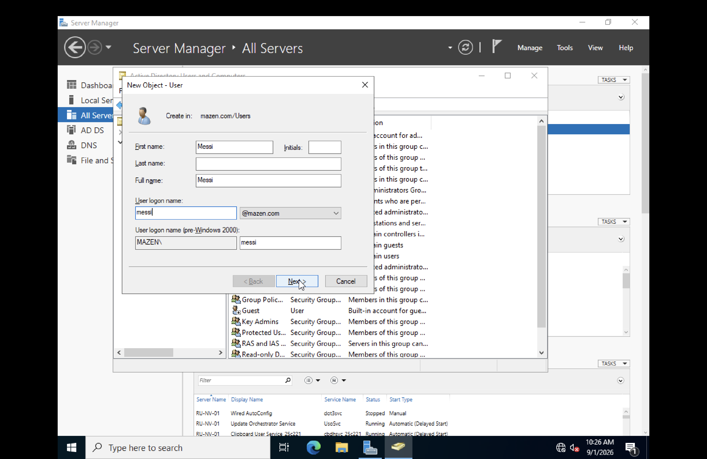
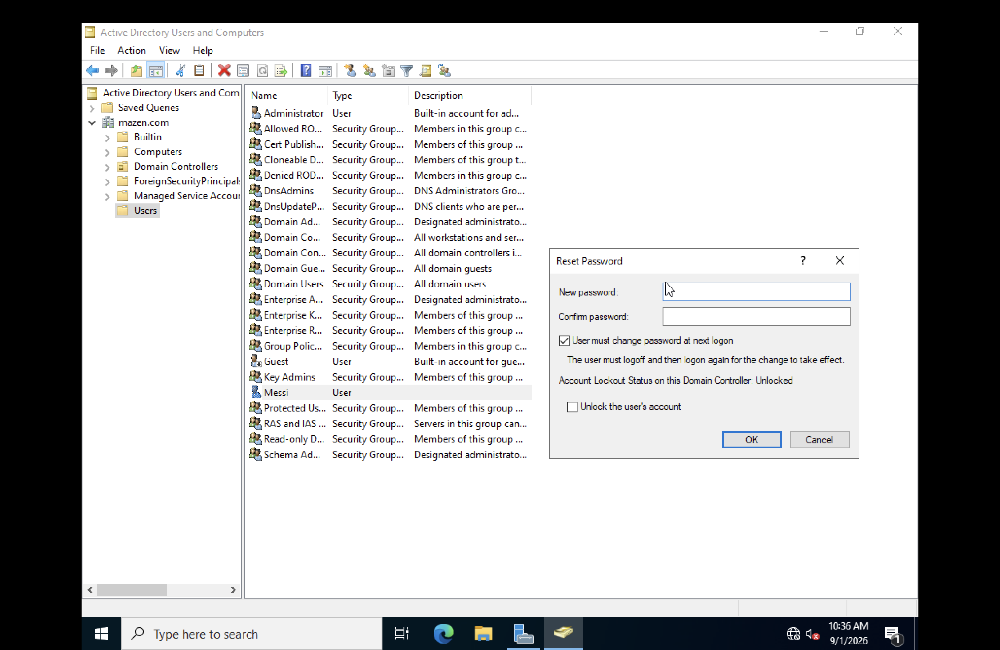
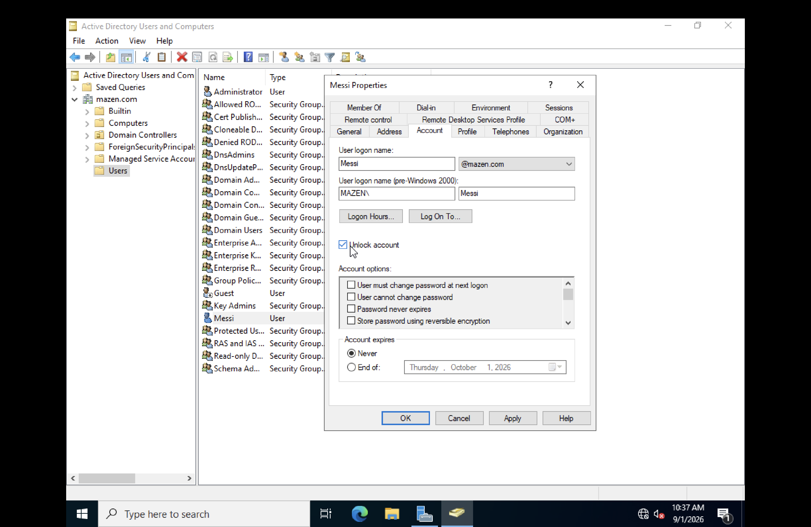

# 🛡 Active Directory - User Management Lab

## 📌 Scenario

This lab demonstrates basic Active Directory user management using **Active Directory Users and Computers (ADUC)**.

The lab covers creating a user, configuring the account, resetting a password, unlocking an account, and reviewing user properties.

---

## 1. Active Directory Users and Computers

Active Directory Users and Computers (ADUC) is used to manage users and their account settings within the domain.

---

## 2. Create a User

A new Active Directory user account was created through the **New User** wizard.

The created user account was then reviewed, including its account information and group membership.

---

## 3. Reset User Password

The user's password was reset using the Active Directory user management tools.

---

## 4. Unlock User Account

The user account was unlocked from the account management options.

---

## 5. Review User Properties

The user's properties were opened to review and manage account settings.

---

## 🧠 Skills Practiced

- Active Directory Users and Computers (ADUC)
- User account creation
- User account management
- Password reset
- Account unlocking
- Reviewing user properties

## 🎯 What I Learned

This lab provided hands-on practice with basic Active Directory user management and common administrative tasks such as creating users, resetting passwords, unlocking accounts, and reviewing account properties.
