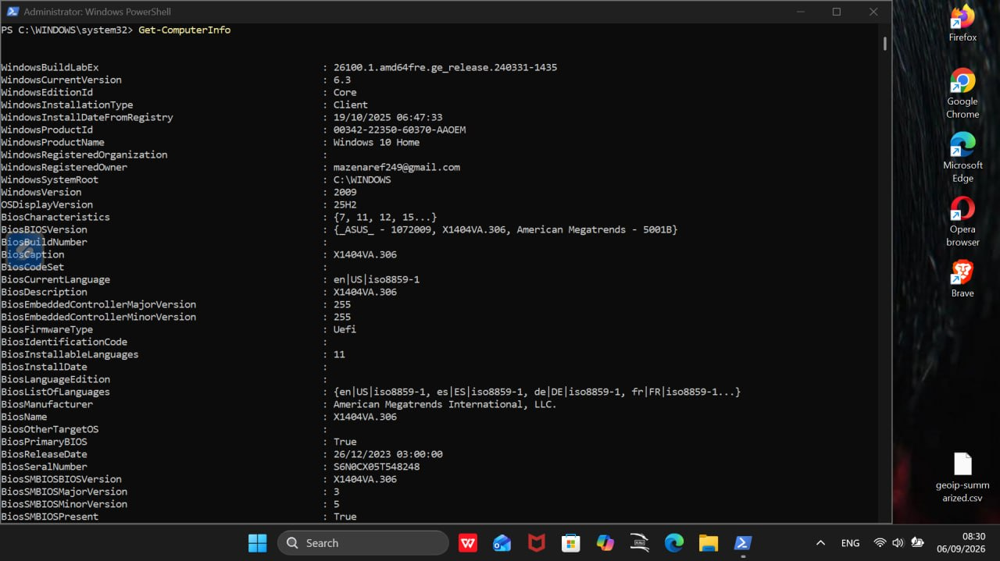
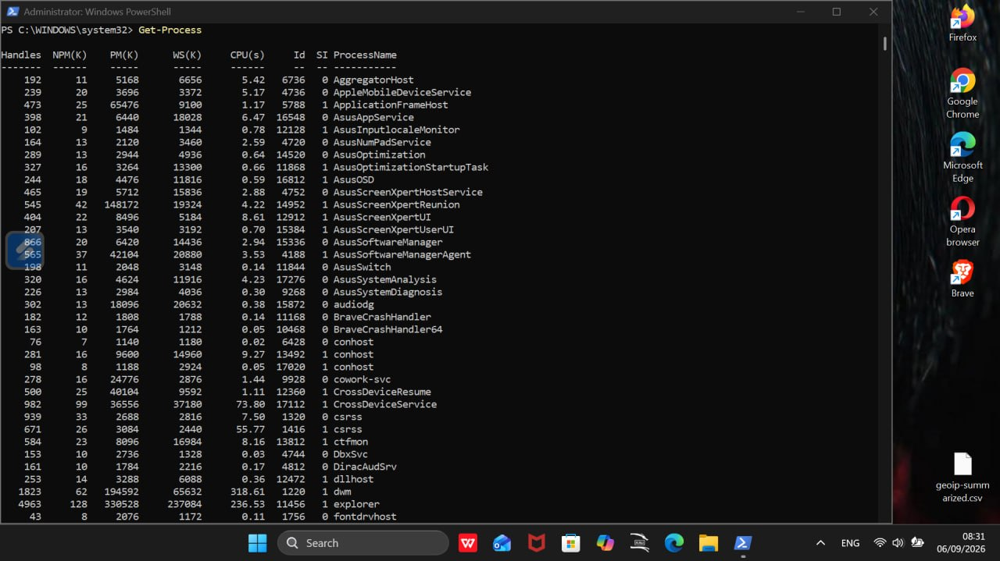
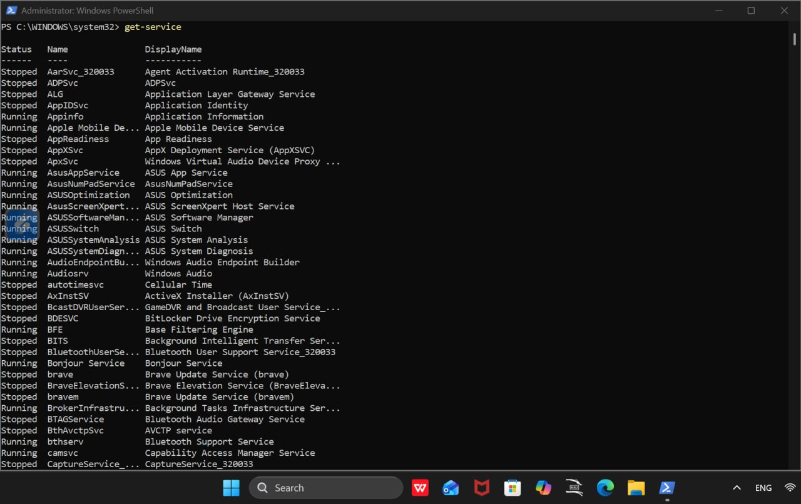
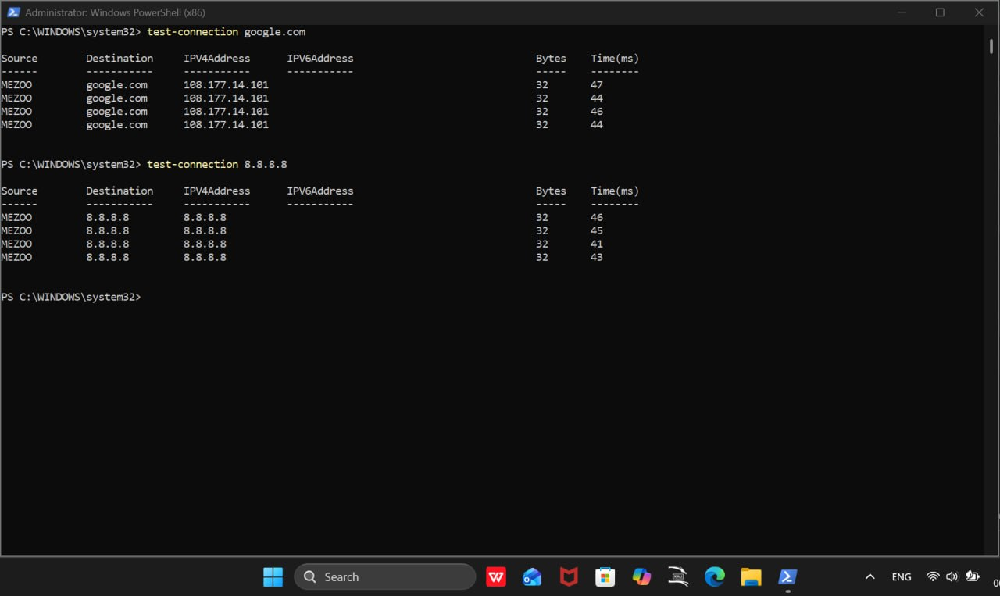
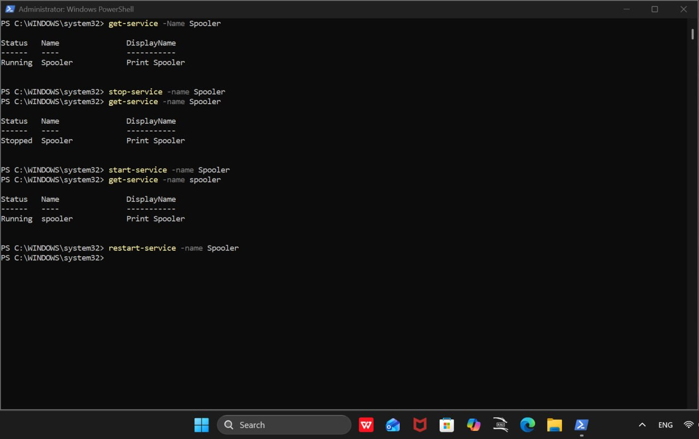
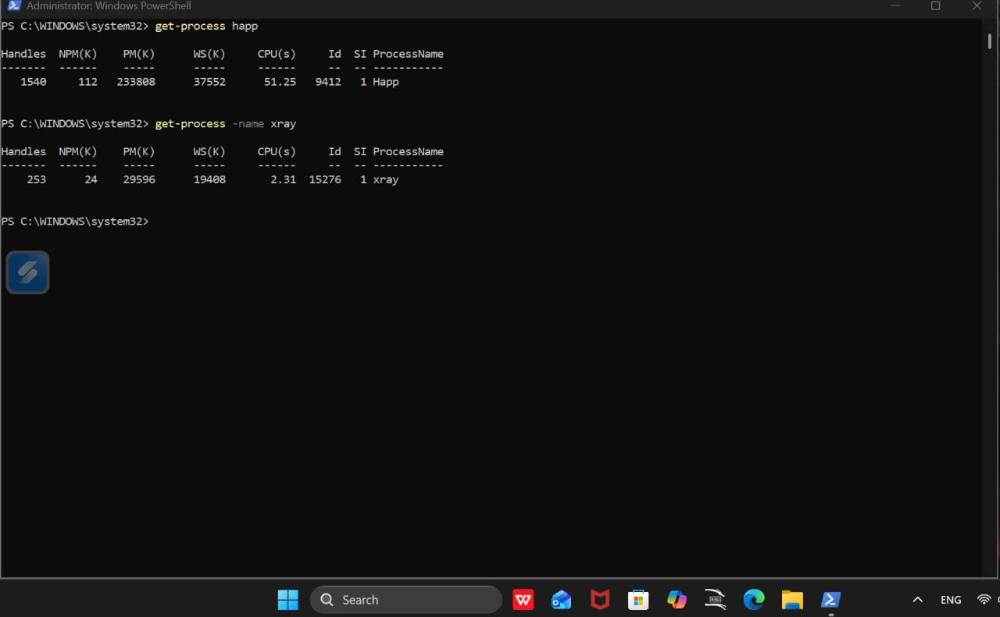

# PowerShell Basics Lab

## 📌 Overview

Hands-on PowerShell lab focused on basic Windows administration and IT Support tasks.

The lab demonstrates how PowerShell can be used to collect system information, inspect running processes, manage Windows services, and test network connectivity.

---

## 🖥️ 1. System Information

Used `Get-ComputerInfo` to collect detailed information about the Windows system.

```powershell
Get-ComputerInfo
```

This command provides detailed information about the Windows operating system and system configuration.



---

## ⚙️ 2. Process Management

Used `Get-Process` to view currently running processes.

```powershell
Get-Process
```

This is useful for inspecting running applications and processes during troubleshooting.



---

## 🔧 3. Service Management

Used PowerShell to check and manage the Windows Print Spooler service.

```powershell
Get-Service -Name Spooler
Stop-Service -Name Spooler
Start-Service -Name Spooler
Restart-Service -Name Spooler
```

These commands can be used to check the service status and stop, start, or restart a Windows service during troubleshooting.



---

## 🌐 4. Network Connectivity Testing

Used `Test-Connection` to test connectivity to a domain and a public IP address.

```powershell
Test-Connection google.com
Test-Connection 8.8.8.8
```

The command can be used to verify basic network connectivity and help troubleshoot connection issues.



---

## 🛠️ 5. Windows Services

Used `Get-Service` to view Windows services and their current status.

```powershell
Get-Service
```

This provides a quick way to inspect services that are running or stopped on a Windows system.



---

## 🔍 6. Specific Process Check

Used `Get-Process -Name` to check specific processes by name.

```powershell
Get-Process -Name happ
Get-Process -Name xray
```

This allows an IT Support technician to quickly check whether a specific process is running.



---

## 🎯 Skills Demonstrated

- PowerShell Basics
- Windows Administration
- Process Management
- Windows Service Management
- Network Connectivity Testing
- System Information Gathering
- Command-Line Troubleshooting

## 🧰 Tools

- Windows PowerShell
- Windows 11