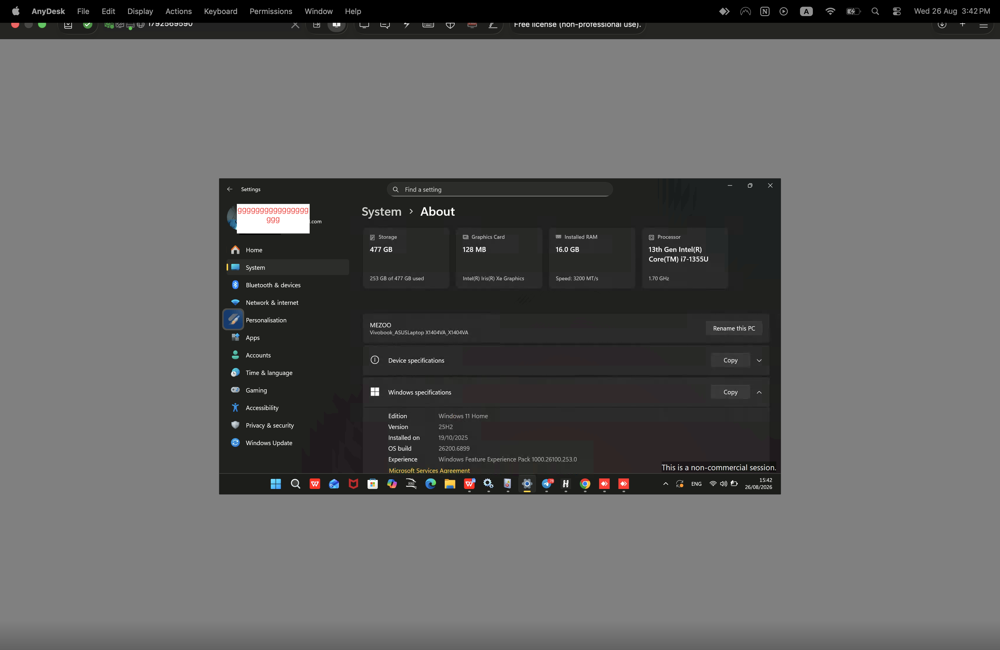
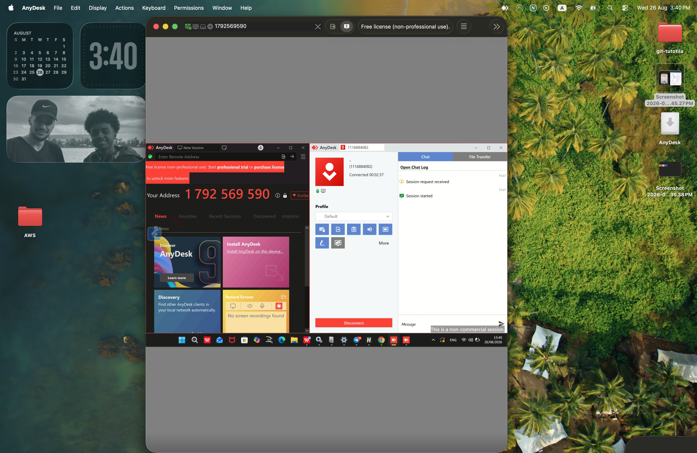

# 🖥️ AnyDesk Remote Support Lab

### Remote Support & Troubleshooting using AnyDesk

---

## 📌 Overview

In this lab, I practiced remote support using AnyDesk between macOS, Windows, and iPhone.

### AnyDesk Features

- 🖥️ Remote device access and control
- 📺 Screen sharing
- 📁 File transfer
- 💬 Session chat
- 🔊 Audio support
- 🔄 Cross-platform remote support

---

## 🛠️ Environment

- macOS — Support Device
- Windows 11 — Client Device
- iPhone — Mobile Support
- AnyDesk

---

## 🔗 Remote Connection

### Mac — AnyDesk

### Windows — System Information

### Remote Session

---

## 📱 Mobile Support

---

## 🎯 Skills Practiced

- Remote Support
- Remote Desktop Access
- Screen Sharing
- File Transfer
- Basic Windows Support
- Session Management
- Troubleshooting

---

## 📚 What I Learned

- How to establish a remote support session.
- How to access and support a Windows device remotely.
- How to use AnyDesk across different devices.
- How to use common remote-support features.
