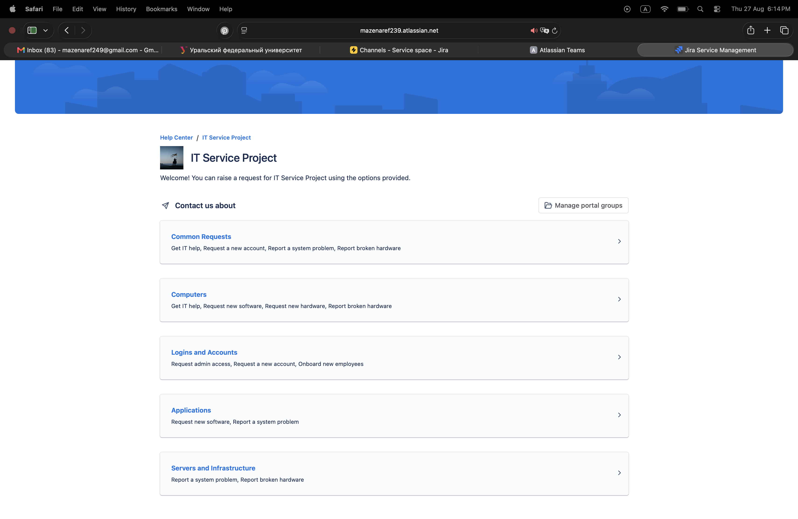
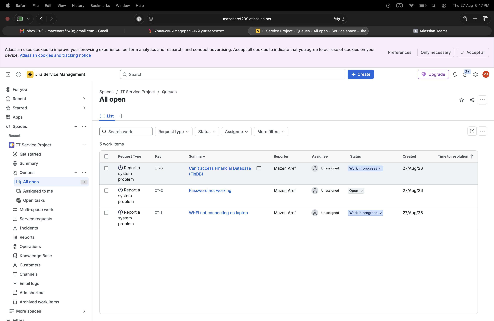
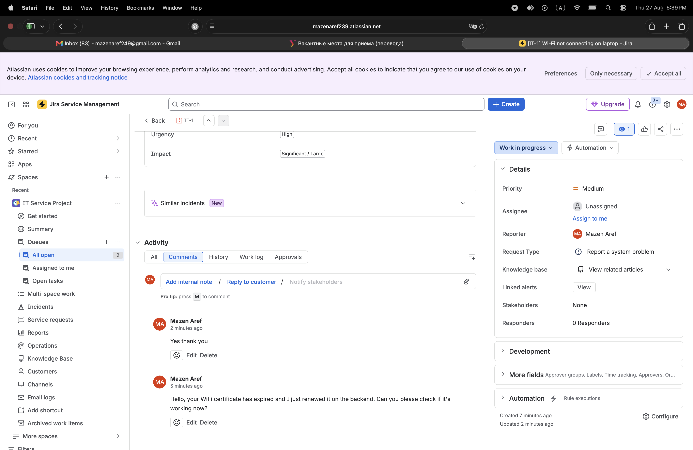

# 🎫 Jira Service Management Ticketing Lab

### IT Support Ticketing & Incident Management using Jira Service Management

---

## 📌 Overview

In this lab, I practiced using Jira Service Management to manage IT support tickets and track user issues.

---

## 🛠️ Environment

- Jira Service Management
- IT Service Project

---

## 🌐 Service Portal

The service portal provides different categories for users to submit IT requests and report problems.

---

## 📋 Ticket Queue

The ticket queue allows IT Support to view and manage reported issues.

---

## 🔧 Ticket Investigation

I practiced handling IT issues by reviewing ticket details, updating the ticket status, communicating with the user, and documenting troubleshooting activity.

---

## 🎯 Skills Practiced

- Ticket Management
- Incident Management
- Ticket Prioritization
- Troubleshooting Documentation
- User Communication
- Ticket Status Management

---

## 📚 What I Learned

- How to create and manage IT support tickets.
- How to organize and track reported issues.
- How to document troubleshooting activity.
- How to communicate with users through a ticket.
- How to manage tickets through the support workflow.