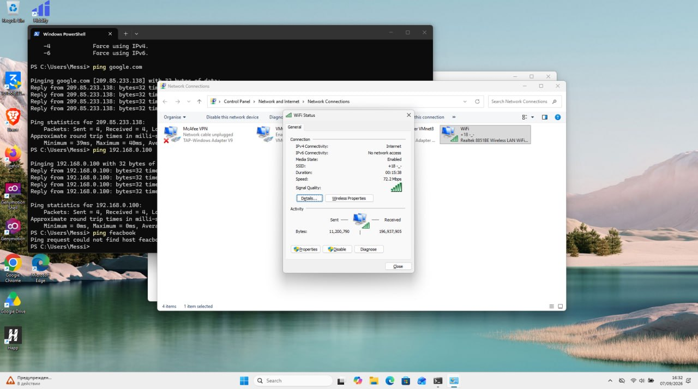
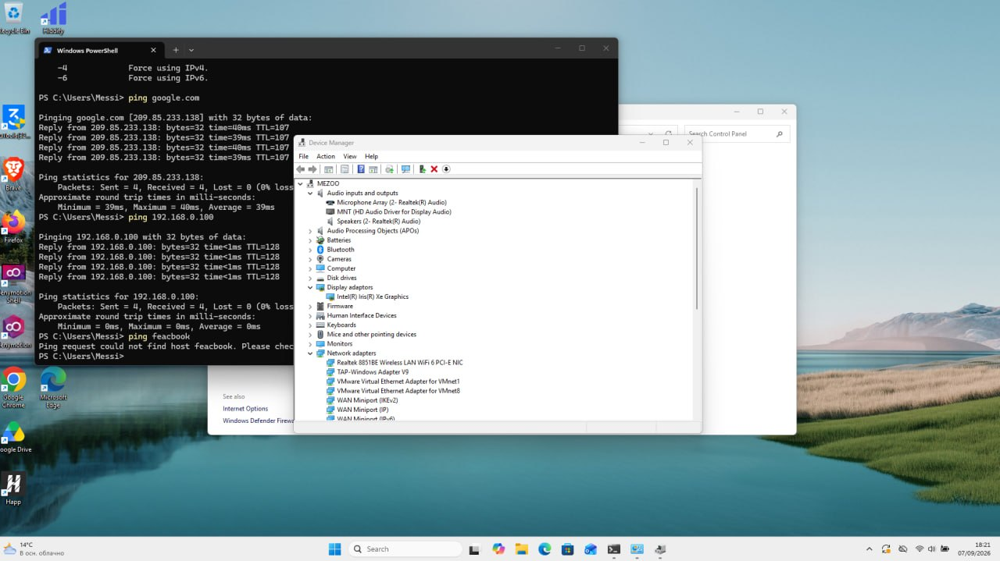
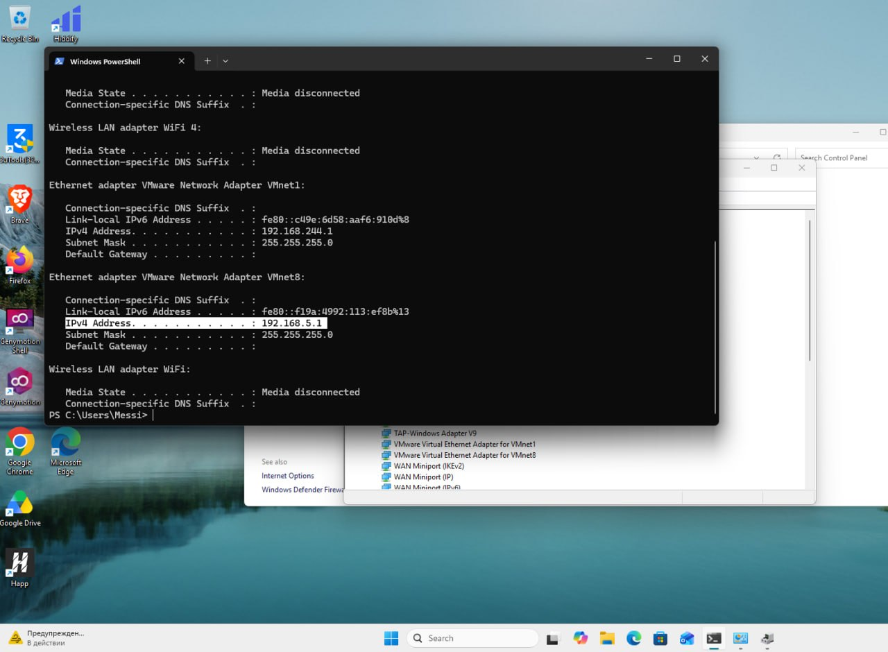
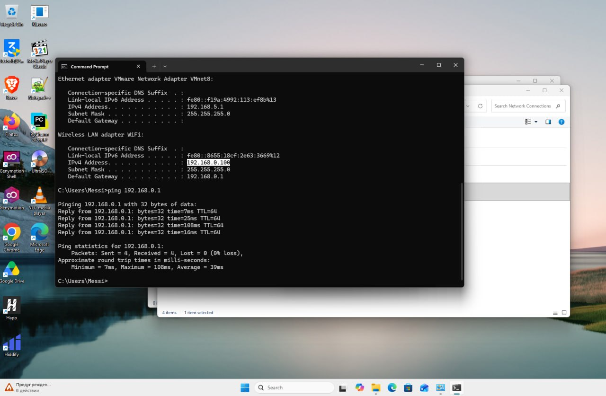
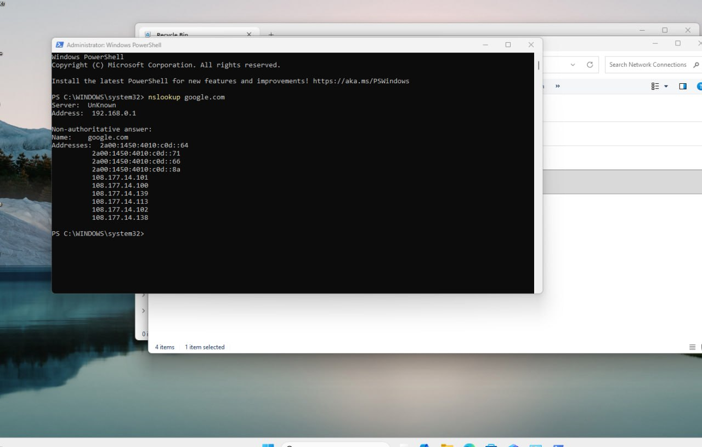
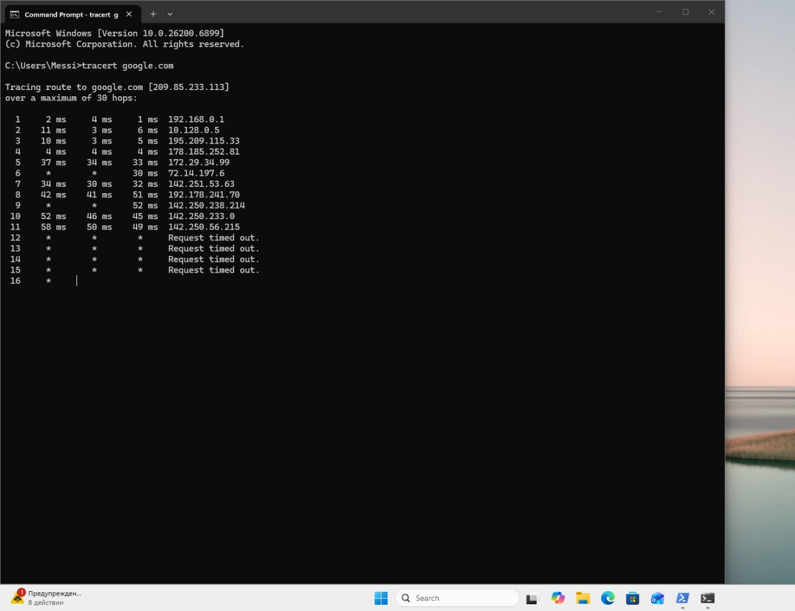
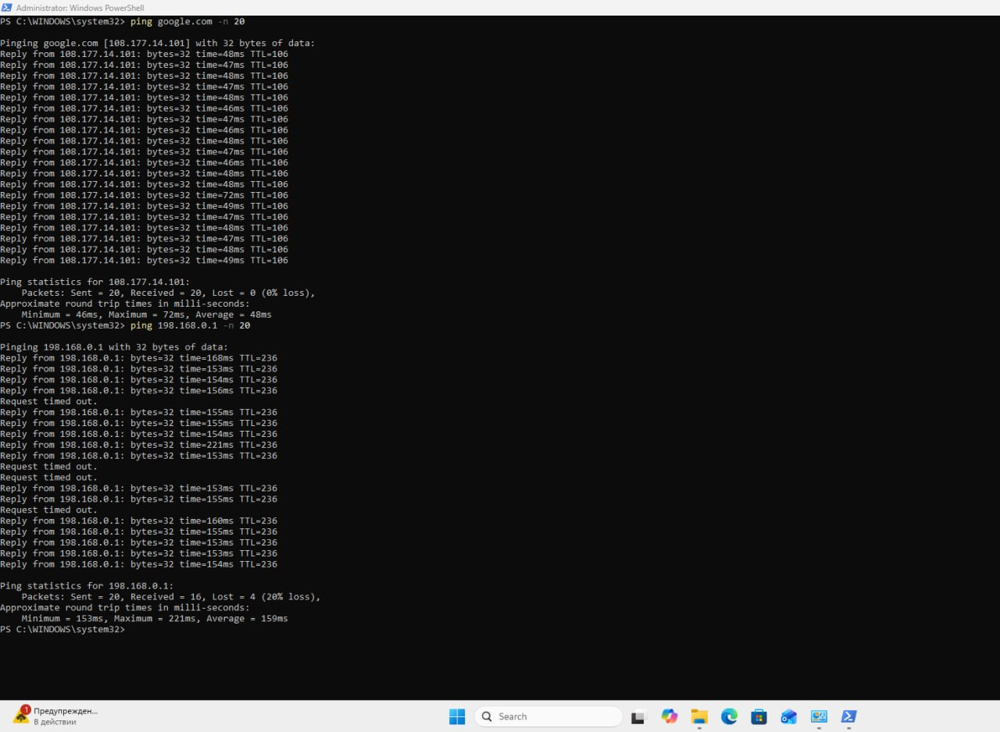
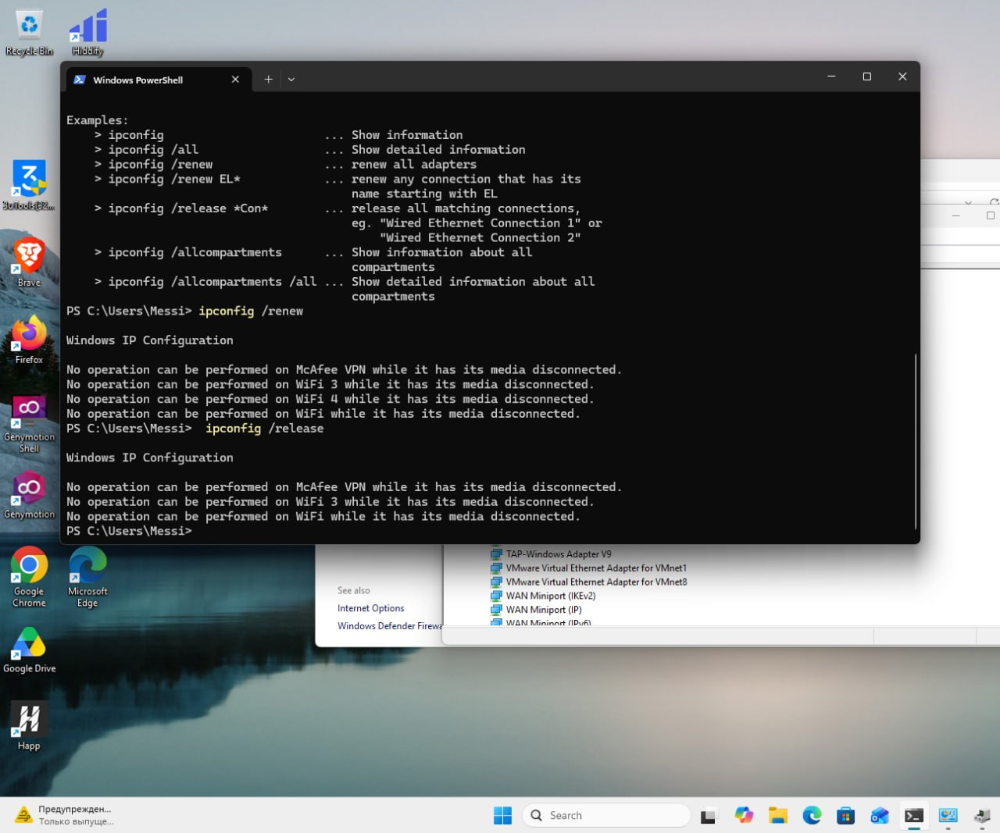
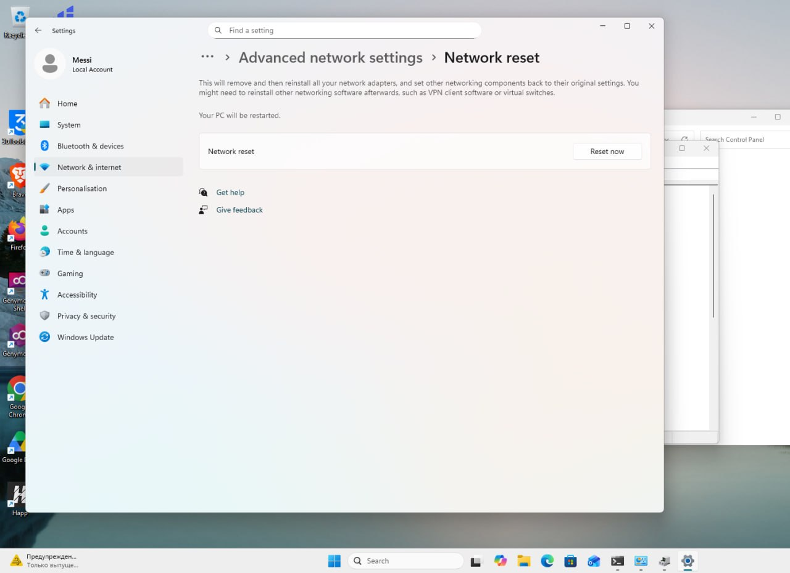

# Network Troubleshooting Lab

## Overview

This lab demonstrates a practical first-line network troubleshooting workflow on Windows.

The lab covers network connectivity, IP configuration, DNS resolution, DHCP, packet loss, latency, network routing, and Windows network troubleshooting tools.

---

## 1. Wi-Fi Connectivity Check

First, I verified the current Wi-Fi connection through Windows Network Connections.

**Observed:**

- IPv4 Connectivity: Internet
- Connection Speed: 72.2 Mbps
- Signal Quality: Good



---

## 2. Network Adapter Verification

I used **Device Manager** to verify that Windows correctly detected the wireless network adapter.

**Adapter:**

`Realtek 8851BE Wireless LAN WiFi 6 PCI-E NIC`

The adapter was detected without a visible device error.



---

## 3. IP Configuration

I used `ipconfig /all` to inspect the Windows network configuration.

```cmd
ipconfig /all
```

**Network Configuration:**

| Setting | Value |
|---|---|
| IPv4 Address | `192.168.0.100` |
| Subnet Mask | `255.255.255.0` |
| Default Gateway | `192.168.0.1` |

This confirms that the system has a valid IPv4 configuration.



---

## 4. Default Gateway Test

I tested connectivity to the local default gateway.

```cmd
ping 192.168.0.1
```

**Result:**

```text
Sent = 4
Received = 4
Lost = 0 (0% loss)
```

The computer was able to communicate successfully with the local gateway.



---

## 5. Internet Connectivity Test

I tested external network connectivity using Google's domain.

```cmd
ping google.com
```

**Result:**

```text
Sent = 4
Received = 4
Lost = 0 (0% loss)
Average = 39ms
```

Internet connectivity was working successfully during the test.

---

## 6. DNS Resolution Test

I used `nslookup` to verify DNS resolution.

```cmd
nslookup google.com
```

The domain name was successfully resolved to IP addresses.

**Conclusion:** DNS resolution was working correctly.



---

## 7. Packet Loss and Latency Test

I tested the Internet connection using 20 ICMP requests.

```cmd
ping google.com -n 20
```

**Result:**

```text
Sent = 20
Received = 20
Lost = 0 (0% loss)
Average = 48ms
```

The Internet connection showed no packet loss during this test.

I then tested the local gateway:

```cmd
ping 192.168.0.1 -n 20
```

**Result:**

```text
Sent = 20
Received = 16
Lost = 4 (20% loss)
Average = 159ms
```

The gateway test showed **20% packet loss and high latency**, indicating a possible local or Wi-Fi connectivity issue.



---

## 8. Traceroute

I used `tracert` to examine the network path to Google.

```cmd
tracert google.com
```

The command displayed multiple network hops between the local system and the destination.

Some hops returned:

```text
Request timed out.
```

A timeout on an individual hop does not necessarily mean that the Internet connection is failing, as some network devices may not respond to traceroute requests.



---

## 9. DHCP Troubleshooting

I tested DHCP lease renewal using:

```cmd
ipconfig /renew
```

Windows returned messages for several disconnected virtual or VPN adapters:

```text
No operation can be performed ... while it has its media disconnected.
```

These messages were related to adapters that were not currently connected.



---

## 10. Network Reset

I reviewed the Windows **Network Reset** option:

**Settings → Network & Internet → Advanced network settings → Network reset**

Network Reset can remove and reinstall network adapters and restore network components to their default settings.

The reset was **not performed** during this lab.



---

# Troubleshooting Workflow

The troubleshooting process followed this sequence:

1. Check Wi-Fi or Ethernet connectivity
2. Check IP configuration
3. Test the default gateway
4. Test external connectivity
5. Test DNS resolution
6. Check packet loss and latency
7. Trace the network path
8. Identify the likely cause
9. Fix, escalate, or document the issue

---

# Findings

The basic Internet connectivity and DNS resolution tests were successful.

However, the local gateway test showed:

- **20% packet loss**
- **159 ms average latency**

This suggests a possible local network or Wi-Fi connectivity issue that would require further investigation.

---

# Skills Practiced

- Windows Network Troubleshooting
- Wi-Fi Troubleshooting
- Network Adapter Troubleshooting
- IP Configuration
- DHCP Troubleshooting
- DNS Troubleshooting
- Default Gateway Testing
- Ping
- Packet Loss Analysis
- Latency Analysis
- Traceroute
- Windows Network Reset
- First-Line Troubleshooting
